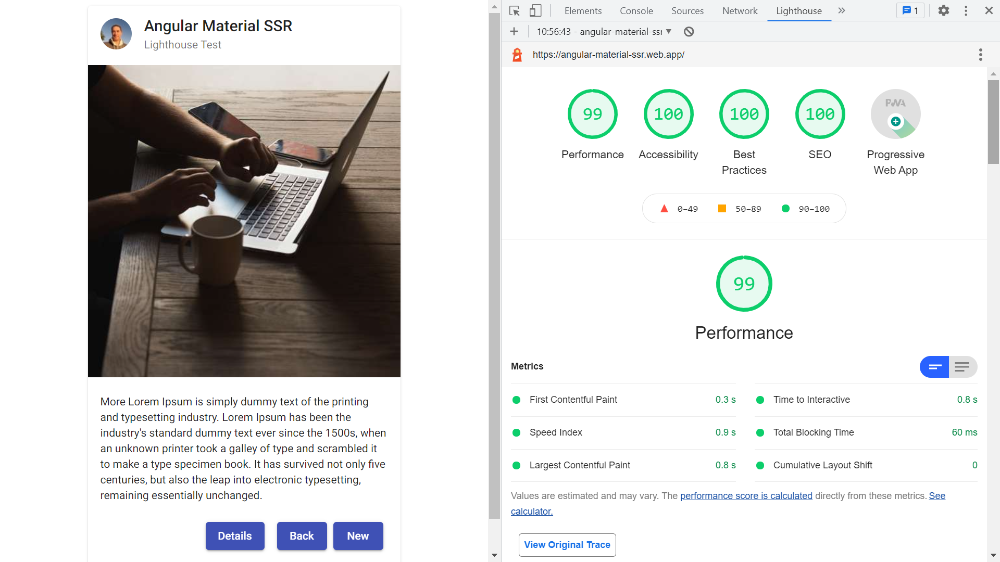

# Angular Material SSR

* Angular app deployed to Firebase functions with Server Side Rendering.
* Progressive Web App
* Optimised for an excellent Lighthouse score
* **Note:** to open web links in a new window use: _ctrl+click on link_


## :page_facing_up: Table of contents

* [Angular Material SSR](#angular-material-ssr)
  * [:page_facing_up: Table of contents](#page_facing_up-table-of-contents)
  * [:books: General info](#books-general-info)
  * [:camera: Screenshots](#camera-screenshots)
  * [:signal_strength: Technologies](#signal_strength-technologies)
  * [:floppy_disk: Setup](#floppy_disk-setup)
  * [:computer: Code Examples](#computer-code-examples)
  * [:cool: Features](#cool-features)
  * [:clipboard: Status & To-Do List](#clipboard-status--to-do-list)
  * [:clap: Inspiration](#clap-inspiration)
  * [:file_folder: License](#file_folder-license)
  * [:envelope: Contact](#envelope-contact)

## :books: General info

* Firebase functions used to serve Node.js SSR app
* Dist folder contains functions folder with browser and server SSR code.
* Functions folder contains a copy of dependencies from the src package.json file
* App contains Angular Material card to see effect on rendering speed.
* [Roboto font style: Regular 400](https://fonts.google.com/specimen/Roboto) used

## :camera: Screenshots



## :signal_strength: Technologies

* [Angular v14](https://angular.io/)
* [Angular Universal v14](https://angular.io/guide/universal) added for Server Side Rendering (SSR)
* [Angular Material v14](https://material.angular.io/) Material Design components
* [Firebase Functions](https://firebase.google.com/docs/functions) serverless framework to automatically run SSR node.js server app
* [Firebase Emulator](https://firebase.google.com/docs/emulator-suite) tools to test Cloud Functions
* [RxJS v7](http://reactivex.io/) - not used as yet
* [Express v4](https://www.npmjs.com/package/express) Node.js framework

## :floppy_disk: Setup

* Create project in Firebase console then add functions. This can all be done from firebase init in VS COde
* `npm i` to install dependencies
* `npm prune` to remove unused npm modules
* `ng serve` for a dev server. Navigate to `http://localhost:4200/`. The app will automatically reload if you change any of the source files.
* `ng update` to update Angular

* Run `npm run dev:ssr` to see SSR app on a dev server
* Run `npm run build:ssr` to build SSR project. The browser & server build folders will be stored in the `dist/functions` directory.
* `cd dist/functions` then run `firebase emulators:start` for Firebase emulator
* From `/dist/functions` run `npm run deploy` to deploy app to firebase functions & hosting

## :computer: Code Examples

* `server.ts` Express app exported so that it can be used by serverless Functions.

```typescript
//
export function app(): express.Express {
  const server = express();
  const websiteFileLocation = environment.production
    ? 'browser'
    : 'dist/functions/browser';
  const distFolder = join(process.cwd(), websiteFileLocation);
  const indexHtml = existsSync(join(distFolder, 'index.original.html'))
    ? 'index.original.html'
    : 'index';

  // Our Universal express-engine (found @ https://github.com/angular/universal/tree/master/modules/express-engine)
  server.engine(
    'html',
    ngExpressEngine({
      bootstrap: AppServerModule,
    })
  );

  server.set('view engine', 'html');
  server.set('views', distFolder);

  server.get(
    '*.*',
    express.static(distFolder, {
      maxAge: '1y',
    })
  );

  server.get('*', (req, res) => {
    res.render(indexHtml, {
      req,
      providers: [{ provide: APP_BASE_HREF, useValue: req.baseUrl }],
    });
  });

  return server;
}
```

## :cool: Features

* Excellent Lighthouse score

## :clipboard: Status & To-Do List

* Status: Working SSR & PWA. Excellent Lighthouse score. Deployed to Firebase Functions
* To-Do: Use to create an actual app with content. Update sitemap & robots.txt

## :clap: Inspiration

* [Codeible: Server Side Rendering with Angular, Angular Universal, & Firebase 2021](https://www.youtube.com/watch?v=k7pLxaKkHYs)
* [Dev.to: Loading Google Fonts and any other web fonts as fast as possible in early 2021](https://dev.to/masakudamatsu/loading-google-fonts-and-any-other-web-fonts-as-fast-as-possible-in-early-2021-4f5o)
* [MDN: Link types: preload](https://developer.mozilla.org/en-US/docs/Web/HTML/Link_types/preload#Cross-origin_fetches)

## :file_folder: License

* This project is licensed under the terms of the MIT license.

## :envelope: Contact

* Repo created by [ABateman](https://github.com/AndrewJBateman), email: gomezbateman@yahoo.com
